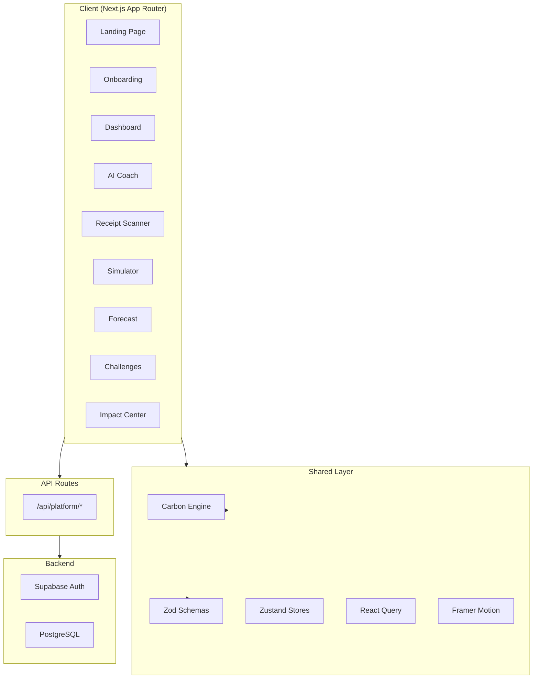

# 🌿 CarbonTwin AI

> **Understand. Predict. Reduce.** — An AI-powered sustainability platform that helps users track, forecast, simulate, and reduce their carbon footprint.

[](https://nextjs.org/)
[](https://typescriptlang.org/)
[](https://tailwindcss.com/)
[](https://supabase.com/)
[](LICENSE)

---

## ✨ Features

| Feature | Description |
|---------|-------------|
| **Dashboard** | Carbon Health Score (0-100), monthly footprint, emission trends, category breakdown, milestones, and annual projection |
| **AI Carbon Coach** | ChatGPT-style assistant with structured recommendations including CO₂ reduction, cost savings, difficulty, and time estimates |
| **Receipt Scanner** | Upload receipts to extract vendor, amount, and category — auto-generate carbon impact estimates |
| **What-If Simulator** | Interactive sliders for transport, food, energy, and travel — real-time carbon modeling with comparison charts |
| **Forecast Engine** | Predictive analytics with baseline vs optimized trajectories, AI signals, and reduction opportunities |
| **Challenges** | Gamified sustainability missions with streaks, achievements, XP, and tier badges |
| **Impact Center** | Environmental equivalencies (trees, water, energy), reduction history, community ranking |
| **Onboarding Wizard** | 5-step lifestyle questionnaire that generates a personalized Carbon Health Score |
| **Dark Mode** | System-aware + manual toggle with full dark theme |
| **Authentication** | Supabase Auth with sign-in/sign-up, demo mode fallback |

---

## 🏗 Architecture



---

## 🛠 Tech Stack

| Layer | Technology |
|-------|-----------|
| **Framework** | Next.js 15 (App Router, Server Components) |
| **Language** | TypeScript 5 (strict mode) |
| **Styling** | Tailwind CSS v4, CSS custom properties |
| **UI Library** | Shadcn UI (radix-nova style) |
| **Animation** | Framer Motion |
| **Charts** | Recharts |
| **State** | Zustand (persisted), React Query |
| **Validation** | Zod |
| **Auth** | Supabase Auth (SSR) |
| **Database** | Supabase PostgreSQL |
| **Testing** | Vitest, React Testing Library, Playwright |
| **Deployment** | Vercel-ready |

---

## 📁 Folder Structure

```
src/
├── app/                          # Next.js App Router pages
│   ├── (platform)/               # Authenticated platform routes
│   │   ├── dashboard/
│   │   ├── ai-coach/
│   │   ├── receipt-scanner/
│   │   ├── simulator/
│   │   ├── forecast/
│   │   ├── challenges/
│   │   └── impact/
│   ├── api/platform/             # API routes (Zod-validated)
│   ├── auth/                     # Sign-in / Sign-up
│   └── onboarding/               # Multi-step wizard
├── components/
│   ├── layout/                   # Shell, sidebar, header, brand
│   ├── shared/                   # Reusable components
│   ├── landing/                  # Landing page client component
│   └── ui/                       # Shadcn UI primitives
├── features/                     # Feature-based modules
│   ├── auth/
│   ├── challenges/
│   ├── coach/
│   ├── dashboard/
│   ├── forecast/
│   ├── impact/
│   ├── onboarding/
│   ├── receipts/
│   └── simulator/
├── hooks/                        # Custom hooks (useTheme)
├── lib/                          # Core utilities
│   ├── api/                      # Typed fetch, route helpers
│   ├── supabase/                 # Client, server, middleware
│   ├── carbon-engine.ts          # Carbon calculation engine
│   ├── motion.ts                 # Framer Motion variants
│   └── utils.ts                  # General utilities
├── stores/                       # Zustand stores
├── providers/                    # React context providers
├── config/                       # Navigation config
└── tests/                        # Unit & integration tests
```

---

## 🚀 Getting Started

### Prerequisites

- **Node.js** ≥ 18
- **npm** ≥ 9

### Installation

```bash
# Clone the repository
git clone https://github.com/your-username/carbontwin-ai.git
cd carbontwin-ai

# Install dependencies
npm install

# Set up environment variables
cp .env.example .env.local
# Edit .env.local with your Supabase credentials (optional — runs in demo mode without them)

# Start development server
npm run dev
```

The app will be available at [http://localhost:3000](http://localhost:3000).

### Demo Mode

CarbonTwin AI runs in **demo mode** when Supabase credentials are not configured. All features work with mock data, so you can explore the full platform immediately.

---

## ⚙️ Environment Variables

| Variable | Required | Description |
|----------|----------|-------------|
| `NEXT_PUBLIC_SUPABASE_URL` | No | Your Supabase project URL |
| `NEXT_PUBLIC_SUPABASE_ANON_KEY` | No | Your Supabase anonymous key |

> **Note:** The app works fully without these variables in demo mode.

---

## 🧪 Testing

### Unit & Integration Tests (Vitest)

```bash
# Run all tests
npm run test

# Watch mode
npm run test:watch

# With UI
npm run test:ui
```

### E2E Tests (Playwright)

```bash
# Install Playwright browsers
npx playwright install

# Run E2E tests
npm run test:e2e
```

### Type Checking & Linting

```bash
npm run typecheck
npm run lint
```

---

## 📦 Build & Deployment

### Production Build

```bash
npm run build
npm run start
```

### Deploy to Vercel

1. Push your code to GitHub
2. Import the repository in [Vercel](https://vercel.com)
3. Add environment variables in Vercel dashboard
4. Deploy — Vercel auto-detects Next.js

---

## 🔒 Security

- **Supabase Auth** with SSR session management
- **Zod validation** on all API inputs and outputs
- **Security headers** (X-Frame-Options, X-Content-Type-Options, Referrer-Policy, Permissions-Policy)
- **Input sanitization** via Zod schemas
- **No hardcoded secrets** — all sensitive values via environment variables
- **Error boundaries** prevent crash propagation
- **Protected route awareness** in middleware

---

## ♿ Accessibility

- Semantic HTML5 elements throughout
- ARIA labels on all interactive elements
- Keyboard navigation support
- Visible focus indicators
- Screen reader compatible
- Color contrast compliance
- `prefers-reduced-motion` media query support

---

## 🔮 Future Scope

- **Real AI integration** — Connect to OpenAI/Gemini for intelligent coaching
- **OCR receipt processing** — Tesseract.js or cloud OCR for actual receipt scanning
- **Social features** — Team challenges, organization dashboards
- **Mobile app** — React Native companion app
- **IoT integration** — Smart meter and device data import
- **Carbon offset marketplace** — Partner with offset providers
- **Multi-language support** — i18n for global reach
- **Advanced analytics** — ML-based anomaly detection in emissions
- **API platform** — REST/GraphQL API for third-party integrations

---

## 📄 License

MIT License — see [LICENSE](LICENSE) for details.

---

<p align="center">
  Built with 🌱 by the CarbonTwin AI team
</p>
